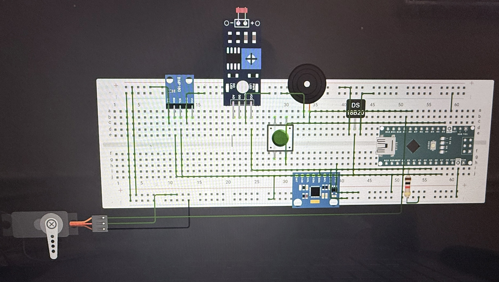

# Routine Reinforcement Band
My project involves developing an innovative wearable armband device that effectively assists users in navigating their routes. This device integrates various sensors connected to an Arduino Nano ESP32, including an accelerometer, a force-sensitive resistor (FSR) pressure sensor, a TMP36 temperature sensor, and a MAX30102 heart rate sensor. Additionally, it boasts a piezo buzzer, a vibration motor, and a button, empowering users to interact with the armband and easily turn it on and off. One of the key challenges I tackled during this project was ensuring the seamless integration of the sensors through efficient coding, and I successfully overcame this obstacle.

| Rushil B | Strake Jesuit College Prepatory | Mechanical Engineering | Incoming Sophmore

**Replace the BlueStamp logo below with an image of yourself and your completed project. Follow the guide [here](https://tomcam.github.io/least-github-pages/adding-images-github-pages-site.html) if you need help.**


  
# Final Milestone

**Don't forget to replace the text below with the embedding for your milestone video. Go to Youtube, click Share -> Embed, and copy and paste the code to replace what's below.**

<iframe width="560" height="315" src="https://www.youtube.com/embed/VBQnCcKGXJs?si=IrSFi-EZITUYmr_G" title="YouTube video player" frameborder="0" allow="accelerometer; autoplay; clipboard-write; encrypted-media; gyroscope; picture-in-picture; web-share" referrerpolicy="strict-origin-when-cross-origin" allowfullscreen></iframe>

For my final milestone, I added a heart rate sensor and worked to integrate all the sensors, focusing on the main challenge of getting them to function together. The heart rate sensor operated correctly on its own or alongside the accelerometer, but when I included the temperature sensor and additional output components, it stopped returning any values. Despite this setback, the project taught me a great deal about Arduino and basic wiring. Moving forward, I hope to tackle even more complex projects that include additional components and advanced programming.


# Second Milestone

<iframe width="560" height="315" src="https://www.youtube.com/embed/3YSxOTTvyp0?si=votf7_DZtZPPYHnr" title="YouTube video player" frameborder="0" allow="accelerometer; autoplay; clipboard-write; encrypted-media; gyroscope; picture-in-picture; web-share" referrerpolicy="strict-origin-when-cross-origin" allowfullscreen></iframe>

For my Second Milestone I added the TMP36 temperature sensor and tested it using simple test code. This milestone is smaller because initially I was planning on using a DS18B20 temperature sensor but it was not wanting to send data to the Arduino after countless attempts at debugging. The TMP36 temperature sensor will detect the temperature in its enviroment and then alert the user of any abnormalities and in the future will be used in more complicated code to do routine reinforcement by detecting enviroment the user is in. My next steps are to add a heart rate sensor as a modification and also create new code to get all the sensors to work together to reinforce 1 routine and then slowly had more until I run out of time.

# First Milestone

<iframe width="560" height="315" src="https://www.youtube.com/embed/voW1c66lyrg?si=G7RpWut8UKeYlnr7" title="YouTube video player" frameborder="0" allow="accelerometer; autoplay; clipboard-write; encrypted-media; gyroscope; picture-in-picture; web-share" referrerpolicy="strict-origin-when-cross-origin" allowfullscreen></iframe>

My first milestone was to integrate all the hardware components for the Routine Reinforcement armband into a electrical system. The componenets include a Arduino Nano ESP32, a accelerometer, a photoresistor, a button, a piezo buzzer, and a vibration motor. The ESP32 is a microcontroller and connects with my computer to run code onto the device. The accelermoeter detects motion and if it detects rapid motion then it will make the piezo buzzer and the vibration motor go off rapidly alerting the user of an abnormality. The photoresistor detects light and since the temperature sensor malfunctioned it is giving a mock temperature and alert the user using the same methods if it is abnormal. The button is used to turn the alert off and on by the user. The main challenge I faced with this milestone is making the DS18B20 temperature sensor not giving data and will switch to the TMP36. My next steps are to add the new tempeture sensor and integrate it into the project and start to think about potentially more sensors to add to the project.

# Schematics 



# Code
Heart rate sensor and accerlerometer together
```c++
#include <Wire.h>
#include "MAX30105.h"
#include "heartRate.h"

MAX30105 particleSensor;

const int MPU_ADDR = 0x68;

// Faster BPM response
const byte RATE_SIZE = 2;
byte rates[RATE_SIZE];
byte rateSpot = 0;
long lastBeat = 0;

float beatsPerMinute = 0;
int beatAvg = 0;

void setup()
{
  Serial.begin(115200);
  delay(2000);

  Serial.println("Initializing sensors...");

  // Initialize I2C
  Wire.begin();

  // ---------- MAX30105 ----------
  if (!particleSensor.begin(Wire, I2C_SPEED_FAST))
  {
    Serial.println("MAX30105 NOT FOUND!");
    while (1);
  }

  Serial.println("MAX30105 Found!");

  particleSensor.setup();
  particleSensor.setPulseAmplitudeRed(0x3F);
  particleSensor.setPulseAmplitudeIR(0x3F);
  particleSensor.setPulseAmplitudeGreen(0);

  // ---------- MPU6050 ----------
  Wire.beginTransmission(MPU_ADDR);
  Wire.write(0x6B);
  Wire.write(0);   // Wake up MPU6050

  if (Wire.endTransmission() == 0)
  {
    Serial.println("MPU6050 Found!");
  }
  else
  {
    Serial.println("MPU6050 NOT FOUND!");
    while (1);
  }

  Serial.println("Setup Complete.");
}

void loop()
{
  // =============================
  // MAX30105 Heart Rate
  // =============================
  long irValue = particleSensor.getIR();

  if (checkForBeat(irValue))
  {
    long delta = millis() - lastBeat;
    lastBeat = millis();

    beatsPerMinute = 60.0 / (delta / 1000.0);

    if (beatsPerMinute > 40 && beatsPerMinute < 180)
    {
      rates[rateSpot++] = (byte)beatsPerMinute;
      rateSpot %= RATE_SIZE;

      beatAvg = 0;
      for (byte i = 0; i < RATE_SIZE; i++)
        beatAvg += rates[i];

      beatAvg /= RATE_SIZE;
    }
  }

  // =============================
  // MPU6050 Accelerometer
  // =============================
  int16_t accelX, accelY, accelZ;

  Wire.beginTransmission(MPU_ADDR);
  Wire.write(0x3B);
  Wire.endTransmission(false);

  Wire.requestFrom(MPU_ADDR, 6, true);

  if (Wire.available() >= 6)
  {
    accelX = Wire.read() << 8 | Wire.read();
    accelY = Wire.read() << 8 | Wire.read();
    accelZ = Wire.read() << 8 | Wire.read();
  }

  // =============================
  // Print Everything
  // =============================
  Serial.print("IR: ");
  Serial.print(irValue);

  Serial.print(" | BPM: ");
  Serial.print(beatsPerMinute, 1);

  Serial.print(" | Avg: ");
  Serial.print(beatAvg);

  Serial.print(" | X: ");
  Serial.print(accelX);

  Serial.print(" | Y: ");
  Serial.print(accelY);

  Serial.print(" | Z: ");
  Serial.println(accelZ);

  delay(5);
}
```
The code with all the sensors working together
``` c++
#include <Wire.h>
#include "MAX30105.h"
#include "heartRate.h"

// ==========================
// PIN DEFINITIONS
// ==========================

const int motorPin = D9;
const int buzzerPin = D8;
const int buttonPin = D2;
const int tempPin = A0;

// ==========================
// SENSORS
// ==========================

MAX30105 particleSensor;

const int MPU_ADDR = 0x68;

// ==========================
// HEART RATE VARIABLES
// ==========================

// Smaller average for faster response
const byte RATE_SIZE = 2;

byte rates[RATE_SIZE];
byte rateSpot = 0;

long lastBeat = 0;

float BPM = 0;
int averageBPM = 0;

// ==========================
// Alert Timing
// ==========================

unsigned long lastAlertTime = 0;
bool alertState = false;

// ==========================
// Sensor Filtering
// ==========================

const int TEMP_SAMPLES = 10;

float tempReadings[TEMP_SAMPLES];
int tempIndex = 0;

// ==========================
// ALERT SETTINGS
// ==========================

bool tempAlert = false;
bool heartAlert = false;
bool motionAlert = false;

bool alertsMuted = false;
bool lastButton = HIGH;

// Temperature Limits

const float LOW_TEMP = 95.0;
const float HIGH_TEMP = 100.4;

// Heart Rate Limits

const int LOW_BPM = 50;
const int HIGH_BPM = 120;

// Motion Limit

const float MOTION_LIMIT = 2.3;

// ==========================
// SETUP
// ==========================

void setup()
{
    Serial.begin(115200);
    delay(1000);

    pinMode(motorPin, OUTPUT);
    pinMode(buzzerPin, OUTPUT);
    pinMode(buttonPin, INPUT_PULLUP);

    digitalWrite(motorPin, LOW);
    noTone(buzzerPin);

    analogReadResolution(12);
    analogSetPinAttenuation(tempPin, ADC_11db);

    // Initialize temperature averaging array
    for (int i = 0; i < TEMP_SAMPLES; i++)
    {
        tempReadings[i] = 98.6;
    }

    // I2C
    Wire.begin();

    // --------------------------
    // MPU6050
    // --------------------------

    Wire.beginTransmission(MPU_ADDR);
    Wire.write(0x6B);
    Wire.write(0);
    Wire.endTransmission();

    // --------------------------
    // MAX30105
    // --------------------------

    if (!particleSensor.begin(Wire, I2C_SPEED_FAST))
    {
        Serial.println("MAX30105 NOT FOUND");
        while (1);
    }

    particleSensor.setup();

    particleSensor.setPulseAmplitudeRed(0x3F);
    particleSensor.setPulseAmplitudeIR(0x3F);
    particleSensor.setPulseAmplitudeGreen(0);

    Serial.println("Routine Armband Ready");
}
// ==========================
// MAIN LOOP
// ==========================

void loop()
{
    checkButton();

    // Read sensors
    readHeartRate();
    float temperatureF = readTemperature();
    float acceleration = readAccelerometer();

    // --------------------------
    // Temperature Alert
    // --------------------------
    tempAlert = (temperatureF < LOW_TEMP || temperatureF > HIGH_TEMP);

    // --------------------------
    // Heart Rate Alert
    // --------------------------
    heartAlert = false;

    if (averageBPM > 0)
    {
        if (averageBPM < LOW_BPM || averageBPM > HIGH_BPM)
        {
            heartAlert = true;
        }
    }

    // --------------------------
    // Motion Alert
    // --------------------------
    motionAlert = (acceleration > MOTION_LIMIT);

    updateAlert();

    printData(temperatureF, acceleration);

    // Small delay so the MAX30105 is read frequently
    delay(5);
}


// ==========================
// TMP36 TEMPERATURE
// ==========================

float readTemperature()
{
    float voltage = analogReadMilliVolts(tempPin) / 1000.0;

    float tempC = (voltage - 0.5) * 100.0;
    float tempF = (tempC * 9.0 / 5.0) + 32.0;

    // Store newest reading
    tempReadings[tempIndex] = tempF;

    tempIndex++;

    if (tempIndex >= TEMP_SAMPLES)
    {
        tempIndex = 0;
    }

    // Average temperature
    float average = 0;

    for (int i = 0; i < TEMP_SAMPLES; i++)
    {
        average += tempReadings[i];
    }

    average /= TEMP_SAMPLES;

    return average;
}


// ==========================
// HEART RATE
// ==========================

void readHeartRate()
{
    // Check for new samples from the MAX30105
    particleSensor.check();

    while (particleSensor.available())
    {
        long irValue = particleSensor.getIR();

        if (checkForBeat(irValue))
        {
            long delta = millis() - lastBeat;
            lastBeat = millis();

            BPM = 60.0 / (delta / 1000.0);

            if (BPM > 40 && BPM < 180)
            {
                rates[rateSpot++] = (byte)BPM;
                rateSpot %= RATE_SIZE;

                averageBPM = 0;

                for (byte i = 0; i < RATE_SIZE; i++)
                {
                    averageBPM += rates[i];
                }

                averageBPM /= RATE_SIZE;
            }
        }

        // Move to the next unread sample
        particleSensor.nextSample();
    }
}
// ==========================
// MPU6050
// ==========================

float readAccelerometer()
{
    int16_t x, y, z;

    Wire.beginTransmission(MPU_ADDR);
    Wire.write(0x3B);

    if (Wire.endTransmission(false) != 0)
    {
        return 0;
    }

    Wire.requestFrom(MPU_ADDR, 6, true);

    if (Wire.available() < 6)
    {
        return 0;
    }

    x = (Wire.read() << 8) | Wire.read();
    y = (Wire.read() << 8) | Wire.read();
    z = (Wire.read() << 8) | Wire.read();

    float ax = x / 16384.0;
    float ay = y / 16384.0;
    float az = z / 16384.0;

    float totalG = sqrt(ax * ax + ay * ay + az * az);

    return totalG;
}


// ==========================
// BUTTON
// ==========================

void checkButton()
{
    bool current = digitalRead(buttonPin);

    if (lastButton == HIGH && current == LOW)
    {
        alertsMuted = !alertsMuted;

        Serial.println(
            alertsMuted ?
            "Alerts OFF" :
            "Alerts ON"
        );

        delay(250);   // Simple debounce
    }

    lastButton = current;
}


// ==========================
// ALERT OUTPUT
// ==========================

void updateAlert()
{
    unsigned long now = millis();

    // No alerts
    if (!tempAlert && !heartAlert && !motionAlert)
    {
        digitalWrite(motorPin, LOW);
        noTone(buzzerPin);
        return;
    }

    // Alerts muted
    if (alertsMuted)
    {
        digitalWrite(motorPin, LOW);
        noTone(buzzerPin);
        return;
    }

    // --------------------------
    // HEART RATE ALERT
    // --------------------------
    if (heartAlert)
    {
        if (now - lastAlertTime >= 250)
        {
            alertState = !alertState;
            lastAlertTime = now;
        }

        if (alertState)
        {
            tone(buzzerPin, 2500);
            digitalWrite(motorPin, HIGH);
        }
        else
        {
            noTone(buzzerPin);
            digitalWrite(motorPin, LOW);
        }

        return;
    }

    // --------------------------
    // TEMPERATURE ALERT
    // --------------------------
    if (tempAlert)
    {
        if (now - lastAlertTime >= 1000)
        {
            alertState = !alertState;
            lastAlertTime = now;
        }

        if (alertState)
        {
            tone(buzzerPin, 1500);
            digitalWrite(motorPin, HIGH);
        }
        else
        {
            noTone(buzzerPin);
            digitalWrite(motorPin, LOW);
        }

        return;
    }

    // --------------------------
    // MOTION ALERT
    // --------------------------
    if (motionAlert)
    {
        digitalWrite(motorPin, HIGH);
        tone(buzzerPin, 1000);

        delay(100);

        digitalWrite(motorPin, LOW);
        noTone(buzzerPin);
    }
}
// ==========================
// SERIAL DISPLAY
// ==========================

void printData(float temp, float g)
{
    Serial.print("Temp: ");
    Serial.print(temp, 1);
    Serial.print(" F");

    Serial.print(" | BPM: ");
    if (averageBPM > 0)
        Serial.print(averageBPM);
    else
        Serial.print("--");

    Serial.print(" | Current BPM: ");
    if (BPM > 0)
        Serial.print(BPM, 1);
    else
        Serial.print("--");

    Serial.print(" | G: ");
    Serial.print(g, 2);

    Serial.print(" | Alerts: ");

    if (!tempAlert && !heartAlert && !motionAlert)
    {
        Serial.print("None");
    }
    else
    {
        if (tempAlert)
            Serial.print("TEMP ");

        if (heartAlert)
            Serial.print("HEART ");

        if (motionAlert)
            Serial.print("MOTION ");
    }

    Serial.println();
}
```

# Bill of Materials

| Arduino ESP32 | The Arduino ESP32 is used as a center hub controlling power and different ports controlling individual components | $19.30 | <a href="http://amazon.com/Arduino-ABX00083-Bluetooth-MicroPython-Compatible/dp/B0C947BHK5/ref=sr_1_1?dib=eyJ2IjoiMSJ9.89rZbVYBSTMMiBZolsKdQ1JbLZ1axNOIl2hS6CJIWo0HL9RaP36mau8YJR7d4YL-dlqwa81J4FhRJGA28BKIB11EF6qTl7wo1wkMgqMpA2YjhM3rXbzYxRAz7EG0ldwpZXoAbk6oVmmD9DqDqra15LhN9qqqIglWO8yc1T9HLsDDLn7i7bSHjYbLL0fXdhfr28U3MVjZcV6aFricknSbAtqOthcPUn596rjjXyABeZI._3HWddX8HbWsFMxE_vGfBpsw76mZLOdoIYzCDg59Osc&dib_tag=se&keywords=arduino+esp21&qid=1779543906&sr=8-1"> Link </a> |
| Resistive Force Sensor | This sensor is used to detect the amount of pressure that is being applied to the arm | $11.99 | <a href="https://www.amazon.com/Pressure-Sensitivity-Sensitive-Industrial-Measurement/dp/B0CZ6L5NMM/ref=sr_1_3?crid=XJIHW8N70DV6&dib=eyJ2IjoiMSJ9.QQ9r8Wu_y4jkx1UX9ACQ9CgT5gH99mlk0yFozn-67HSS25_XEHdHyuO1g_i0IL-ceuRJgl0g92Ntah_jqVWtt9tY3b-784Vs_R03oljPTR6Fvh1G-Cvk7ESzWVnNEDfgiy3Xo6fPZ1b8Kh4xzAnoVbvxMvIGmSEp50CznzhybkZJ0KpHRtbGKKvKOtXoXQgOA7TWqO3xSg1DQypQP4riGkUbZus51xiFInJ_qU1mWRE.UnsWPUtYcNlAJssDCGv2GIV1eMhbFgYq_KZUV5m6DAk&dib_tag=se&keywords=resistive+force+sensor&qid=1779543943&sprefix=resistive+force+sensor%2Caps%2C144&sr=8-3"> Link </a> |
| Vibrating Mini motor | The vibrating mini motor is used to alert the user of any abnormalities by vibrating on there arm | $5.99 | <a href="https://www.amazon.com/Vibration-Arduino-MEGA2560-9000RPM-Minimum/dp/B0DY65KVQR/ref=sr_1_1?crid=1S59CCT73SV8&dib=eyJ2IjoiMSJ9.7WY8eBeZYk-JumG3DEeHlo7IjKHAMevWkk7OYafg2gc-Mz-xwUwh6krkN5s0TuBz4P6baDiDAaTsJnuEwKQzcdbrZqS6iWMxHDIF3jkX7c4dyW9_o5sX5zSQuiJhGE7VAm4_eoBCTqZ9HZrk655n7PKZ_IWk1_CnivnrwmH5DyPxq-7rQmPv50ffqTOcqZBjo-_b6latDLMGBwU71f59oFaVq_i-GIfia4JtGZg2ZTJtaV_Xx_W5Rl92fMUHOOJfeKRP7wxrR9JdXTeEXZ_-x38AJCqtWhpkew4uAIHUVCc.JT7tIlPxla1DZcswxscwWJPPJ5rB89BwYFmVtctBCBs&dib_tag=se&keywords=vibrating+mini+motor+breadboard&qid=1779543994&sprefix=vibrating+mini+motor+breadboar%2Caps%2C138&sr=8-1"> Link </a> |
| Acceleromater | This sensor is used to determine the amount of movement the arm is going through | $15.99 | <a href="https://www.amazon.com/AOICRIE-Accelerometer-Gyroscope-Pre-Soldered-Raspberry/dp/B0D2TJVMNY/ref=sr_1_2?crid=1L0I30GP7CQCB&dib=eyJ2IjoiMSJ9.sD3cvyJuuiBIzNpvEcB2k6vg_iGFBCCkml9_l0Yyu2COzstngvy9dv8pKFHk-h1mllowcq8zDPAAqKPTD0s4w1y4-Mr2WUeT9GOp7z2ypYt33o3f4afGXGo-v8yiZOI1hn0vjCx4c2r81KjDA71cQ_Go-dhX5v5WCvGgfEWylJlylWjgAcKJvRrjYNWVGOEAeo43mTvNwxpaHkKrgTuEaMQoGecsCCeXbNHDkBXKVlc.lnwJdbVyLX_f3LU0NtMIPyEExBkR-rsk2Ne3t508o0w&dib_tag=se&keywords=SHILLEHTEK+MPU6050+%2F+MPU-6050+Pre-Soldered+GY-521+Module+%7C+6-Axis+Accelerometer+Sensor+%26+IMU+Sensor&nsdOptOutParam=true&qid=1779933942&sprefix=shillehtek+mpu6050+%2F+mpu-6050+pre-soldered+gy-521+module+6-axis+accelerometer+sensor+%26+imu+sensor+%2Caps%2C113&sr=8-2"> Link </a> |
| USBC | The USBC is a connecting wire of USB-A to USB-C to connect my laptop with the arduino | $5.99 | <a href="https://www.amazon.com/Amazon-Basics-Charger-480Mbps-Certified/dp/B01GGKYKQM/ref=sr_1_1_ffob_sspa?crid=99C3JROE9QB4&dib=eyJ2IjoiMSJ9.Ji_f3dNmLfwbgzV1UTggFcuGmJLCpn6s8uhHf7byueIFm-vd7CVXFm9RRXNbXvrrF9s7po3Z4RiP7taiGGliUnXEUbbc9WwpX2v1ST_EPBERya6IJFNFaCS0k8bu0MSy-t3u4gd6T1Ujegi1jWV_jVTPtA0NNtdw7mipoyEWlumWQ89p-u51El58h3lUE1gd-k_KfzEQGpTANCUtzIGFdUmFFrYFneoZ1juYw979Auc.hnx3sO9K0wVjMwc9Q2_on-sCuFnMmq45rcNCrojkfME&dib_tag=se&keywords=usb+c+to+usb&qid=1779544164&sprefix=usb+c+to+usb%2Caps%2C149&sr=8-1-spons&sp_csd=d2lkZ2V0TmFtZT1zcF9hdGY&psc=1"> Link </a> |
| Analog Temperature Sensor | The Analog Temperture sensor is used to sense the body temputure of the user and alert them if it is high | $12.99 | <a href="https://www.amazon.com/OSOYOO-TMP36-Temperature-self-Heating-Precision/dp/B0GKG3FLCL/ref=sr_1_4?crid=2L31MF680INTD&dib=eyJ2IjoiMSJ9.4JDjgkP_royTQWoaiJ1aPJ198Dj5Bg0GCSFYyER6nIQbHmNn_ZcjbpErUyBxRSjVdsXvMYcKJWT0LTfgR3XL9z497Vf_cHSOdnf-tw2iXta0ZSmNIEpk189SIs7zEURIN1W77cp0qpXfFPZknW3Moe1Iy037pBQYzT4ryjmalfP1GRmLXYBkzBoLekO2-O4jwEj4wSclBoWgM5v4G9VYhHNYmDyn_rxhtBFfX3-ccuI.TK3db6gzDwS3AETOqGhunf4CjeWfTYv9S9jWDV8u2t8&dib_tag=se&keywords=TMP36%2B-%2BAnalog%2BTemperature%2Bsensor%2B-%2BTMP36&qid=1781628582&sprefix=tmp36%2B-%2Banalog%2Btemperature%2Bsensor%2B-%2Btmp36%2Caps%2C583&sr=8-4&th=1"> Link </a> |
| Armband | The armband is used to connect the contraption and make it stay onto the users arm | $5.98 | <a href="https://www.amazon.com/Armbands-Adjustable-Memorial-Basketball-Volleyball/dp/B0D58Z7KMK"> Link </a> |
| Electronics Kit | The electronics kit comes with different buttons, LEDS, and wires to use and create inputs/outputs for the user | $14.99 | <a href="https://www.amazon.com/Smraza-Electronics-Potentiometer-tie-Points-Breadboard/dp/B0B62RL725/ref=sxts_b2b_sx_reorder_acb_business?content-id=amzn1.sym.f63a3b0b-3a29-4a8e-8430-073528fe007f%3Aamzn1.sym.f63a3b0b-3a29-4a8e-8430-073528fe007f&crid=2IC3T44H3U3WG&cv_ct_cx=breadboard+kit&dib=eyJ2IjoiMSJ9.TUd5tu2T8rmms7ZuJ0UzmbtpLL1zsu93bQM0PzwnP4E.sT0V0vL_QtbYv8ymVTCcRkhFNgBtRvRiT7G4FT1oGTE&dib_tag=se&keywords=breadboard+kit&pd_rd_i=B0B62RL725&pd_rd_r=67e1f4ff-e3b9-44e4-b441-b4ae282f036b&pd_rd_w=UjFaP&pd_rd_wg=0xRoC&pf_rd_p=f63a3b0b-3a29-4a8e-8430-073528fe007f&pf_rd_r=BFGP77H27ZN31W4PZAW6&qid=1715911733&sbo=RZvfv%2F%2FHxDF%2BO5021pAnSA%3D%3D&sprefix=breadboard+kit%2Caps%2C109&sr=1-2-9f062ed5-8905-4cb9-ad7c-6ce62808241a"> Link </a> |
| 9V barrel jack | The 9V barrel jack is used to bring power from the 9V battery to the contraption | $5.99 | <a href="https://www.amazon.com/DZS-Elec-Connector-Experimental-5-5x2-1mm/dp/B07FDS11ZY/ref=sr_1_5?crid=2KDQRHR9QTG87&dib=eyJ2IjoiMSJ9.QXzrFs_APhSZ1IJhcXZvMQHwewvRuQ3vr1brQtDco3W0bnAprDG7jH7ie8dBlokDPWbOLcDtgbrHrNUzcyb61YgxbGO0UFeN6K8ktLZDkV3jlxoO940ZYOk8jrd3G8yxrkH-cUJgXaiOka1FWDDJJssGcdvyH2WlPRHUtZKQgBpoGa4M3j8wwx3yssPZrOJK32Pfs9ZLtCibGXHxhNbXOBuXOisFlpDByQ2NJcndu5iOa0dZ8jknYgybT1KOyzP9_lSVyQNCkcxcjanEjyf4Z6jMdRX-G08K6SY7IM-agSA.UzM8eWF_dtBmatnqwrbt1mCm8-reUmM7Mqm3SWpbviM&dib_tag=se&keywords=9v+to+barrel+jack&qid=1716857906&s=electronics&sprefix=9v+to+barrel+jack%2Celectronics%2C98&sr=1-5"> Link </a> |
| DMM | The DMM is used to measure electric voltage | $9.98 | <a href="http://amazon.com/gp/product/B0CXM242J1/ref=sw_img_1?smid=A34MWHFZRUFCUF&psc=1"> Link </a> |
| 9V Batteries | The 9V batteries are used to give power to the contraption without it needing a computer connection | $18.18 | <a href="https://www.amazon.com/dp/B00MH4QM1S/ref=vp_d_pb_TIER4_cml_lp_B0BJ26CHZB_pd?_encoding=UTF8&pf_rd_p=b8d9960f-63a9-4d69-a8de-de9514a27e41&pf_rd_r=1RRARBM9YNNHR89D8B2N&pd_rd_wg=FwKYY&pd_rd_i=B00MH4QM1S&pd_rd_w=XrNnI&content-id=amzn1.sym.b8d9960f-63a9-4d69-a8de-de9514a27e41&pd_rd_r=edb0610d-b8f5-4671-814f-f6cb22938f22&th=1"> Link </a> |
| GY-MAX30102 Heart Rate sensor | This sensor is used to detect your heart rate through yur finger | $13.99 | <a href="https://www.amazon.com/Pressure-Sensitivity-Sensitive-Industrial-Measurement/dp/B0CZ6L5NMM/ref=sr_1_3?crid=XJIHW8N70DV6&dib=eyJ2IjoiMSJ9.QQ9r8Wu_y4jkx1UX9ACQ9CgT5gH99mlk0yFozn-67HSS25_XEHdHyuO1g_i0IL-ceuRJgl0g92Ntah_jqVWtt9tY3b-784Vs_R03oljPTR6Fvh1G-Cvk7ESzWVnNEDfgiy3Xo6fPZ1b8Kh4xzAnoVbvxMvIGmSEp50CznzhybkZJ0KpHRtbGKKvKOtXoXQgOA7TWqO3xSg1DQypQP4riGkUbZus51xiFInJ_qU1mWRE.UnsWPUtYcNlAJssDCGv2GIV1eMhbFgYq_KZUV5m6DAk&dib_tag=se&keywords=resistive+force+sensor&qid=1779543943&sprefix=resistive+force+sensor%2Caps%2C144&sr=8-3(https://www.amazon.com/dp/B0D12692LY?ref=fed_asin_title)"> Link </a> |

# Other Resources/Examples
- [Base Project Original link](https://www.instructables.com/Routine-Reinforcement-Armband/)
- [Armband Notes google doc](https://docs.google.com/document/d/1VrPdPcL-Z65wnyhI12oAp2Bm2EwKIptNxDfZ0WaQimU/edit?tab=t.0#heading=h.6mrcrt2tdxpz)
